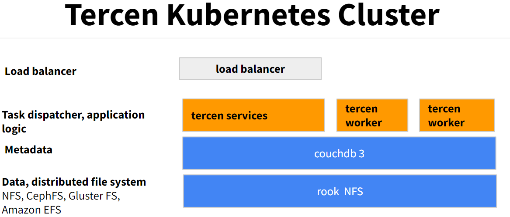

# Introduction

This document describes the installation and usage of [tercen](https://tercen.com/) running on 2 nodes

Requirements: k8s cluster with LoadBalancer service running

2 types of storage are necessary:
- block storage
- shared file system

Any shared file system can be used (CephFS,Amazon EFS,NFS,GlusterFS, etc), in this document we use Rook NFS.

Tercen is composed of a number of components.
- couchdb
- tercen main service
- tercen worker service



# Install Rook NFS

https://rook.io/docs/nfs/v1.7/quickstart.html

```shell
# 
git clone --single-branch --branch v1.7.3 https://github.com/rook/nfs.git

cd nfs/cluster/examples/kubernetes/nfs

kubectl create -f crds.yaml
kubectl create -f operator.yaml
kubectl create -f rbac.yaml


```

## Storage class for EBS

Edit nfs-xfs.yaml and set the following :

```yaml
apiVersion: storage.k8s.io/v1
kind: StorageClass
metadata:
  name: standard-xfs
provisioner: kubernetes.io/aws-ebs
parameters:
  type: io1
  iopsPerGB: "10"
  fsType: xfs
mountOptions:
  - prjquota
reclaimPolicy: Delete
volumeBindingMode: Immediate
```

Create the nfs server.

```shell
kubectl create -f nfs-xfs.yaml
```

Create rook nfs storage class.
```shell
kubectl create -f sc.yaml
```

# Node label

```shell
kubectl get nodes

#"node.kubernetes.io/instance-type": "m5.large",
#kubectl label nodes ip-192-168-6-126.eu-central-1.compute.internal node.tercen.com/instance-type=tercen
kubectl label nodes ip-192-168-6-126.eu-central-1.compute.internal app=tercen
# kubectl get node ip-192-168-6-126.eu-central-1.compute.internal -o json | jq .metadata.labels 

kubectl label nodes ip-192-168-61-38.eu-central-1.compute.internal app=tercen-worker
# kubectl get node ip-192-168-61-38.eu-central-1.compute.internal -o json | jq .metadata.labels 
```

# Install tercen

## Storage
```shell
kubectl apply -f k8s/storage/rook/pvc.yaml
# kubectl delete -f k8s/storage/aws/pvc.yaml
kubectl describe pvc
kubectl get pvc
```

## Couchdb

```shell
kubectl apply -f k8s/couchdb.yaml

COUCH_POD=$(kubectl get pod -l "app=couchdb" -o jsonpath='{.items[0].metadata.name}')
kubectl logs $COUCH_POD
```
## External Tercen service

External Tercen service is a service that is exposed to the internet, here we are using a kubernetes load balancer.

```shell
kubectl apply -f k8s/tercen-service-lb.yaml

# get tercen service external ip
kubectl get svc

```


## Tercen config

Set tercen external ip in config files.

```shell
kubectl create configmap tercen-config --from-file=config.yaml=k8s/tercen-config.txt -o yaml --dry-run=client | kubectl apply -f -
kubectl create configmap tercen-worker-config --from-file=config.yaml=k8s/tercen-worker-config.txt -o yaml --dry-run=client | kubectl apply -f -
```

## Tercen services

```shell

kubectl apply -f k8s/tercen.yaml
kubectl apply -f k8s/tercen-worker.yaml

TERCEN_POD=$(kubectl get pod -l "app=tercen" -o jsonpath='{.items[0].metadata.name}')

kubectl logs $TERCEN_POD tercen

# check if tercen is running
kubectl port-forward $TERCEN_POD 6400:5400
```


# EKS Load balancer

https://docs.aws.amazon.com/eks/latest/userguide/aws-load-balancer-controller.html

```shell
aws eks describe-cluster --name tercen-itos2 --query "cluster.identity.oidc.issuer" --output text

curl -o iam_policy.json https://raw.githubusercontent.com/kubernetes-sigs/aws-load-balancer-controller/v2.3.1/docs/install/iam_policy.json
aws iam create-policy \
    --policy-name AWSLoadBalancerControllerIAMPolicy \
    --policy-document file://iam_policy.json
    
eksctl utils associate-iam-oidc-provider --cluster tercen-itos2 --approve
    
eksctl create iamserviceaccount \
  --cluster=tercen-itos2 \
  --namespace=kube-system \
  --name=aws-load-balancer-controller \
  --attach-policy-arn=arn:aws:iam::605893565571:policy/AWSLoadBalancerControllerIAMPolicy \
  --override-existing-serviceaccounts \
  --approve

helm install aws-load-balancer-controller eks/aws-load-balancer-controller \
  -n kube-system \
  --set image.repository=602401143452.dkr.ecr.eu-central-1.amazonaws.com/amazon/aws-load-balancer-controller \
  --set clusterName=cluster-name \
  --set serviceAccount.create=false \
  --set serviceAccount.name=aws-load-balancer-controller
```